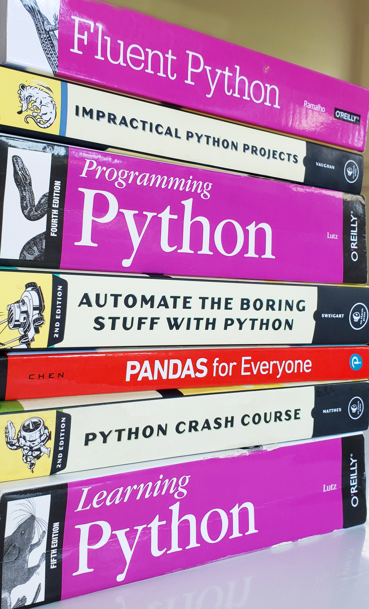

## Project Summary
*Projects and Exercises Inspired by Key Python Textbooks.*  

Based on examples and code challenges in Python reference tomes,
a variety of key python language topics are explored.

Primary reference documents in my library include:
* [Python Crash Course](https://www.amazon.com/Python-Crash-Course-2nd-Edition/dp/1593279280)
* [Programming Python](https://www.amazon.com/Programming-Python-Powerful-Object-Oriented/dp/0596158106/)
* [Learning Python](https://www.amazon.com/Learning-Python-5th-Mark-Lutz/dp/1449355730)
* [Fluent Python](https://www.amazon.com/Fluent-Python-Concise-Effective-Programming/dp/1491946008)

Topics include:
* Kitchen sinks
* Most everything else :)

Projects in this repository tend to be about the python language in general. 
Non-general language books are likely discussed in other repositories.
For example, projects related to _Pandas for Everyone_ 
are covered in the [Scipy](https://github.com/TonySelfStudy/scipy) repository.

Note that most of the code in this repository is scratch code used to gain
proficiency and arrive at proof-of-concepts.

## Library
If buying and reading python books was a sport ... I might be winning :)  

## License

Distributed under the *** License.  
See `*** License Info ***` for more information.

## Contact

Tony Held - tony.held@gmail.com  
Project Link: [https://github.com/TonySelfStudy/python_textbooks](https://github.com/TonySelfStudy/python_textbooks)
